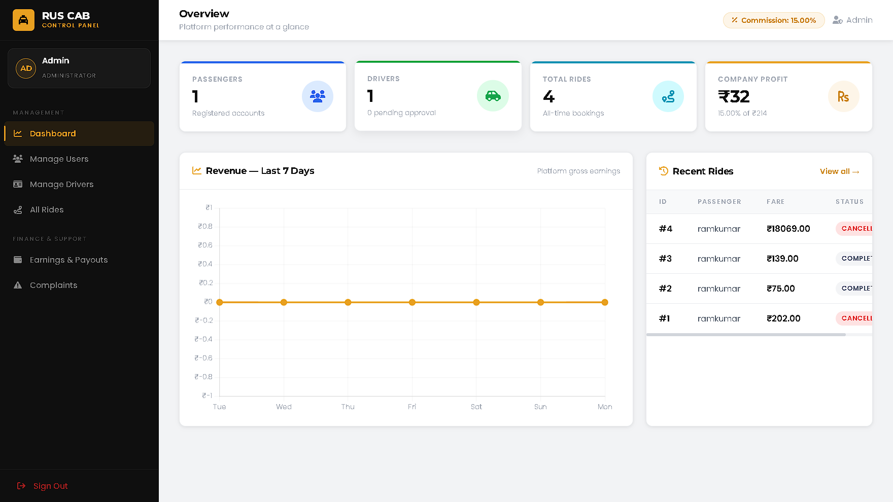
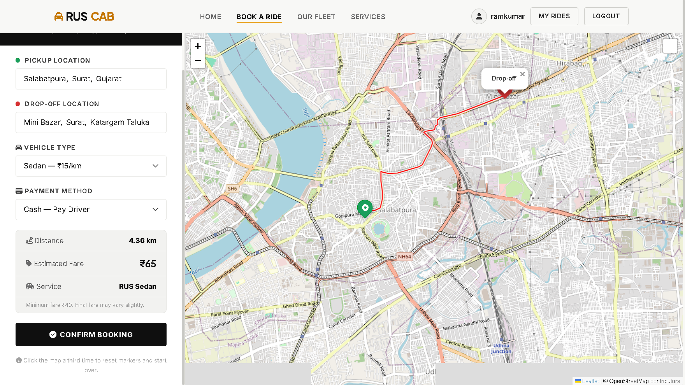
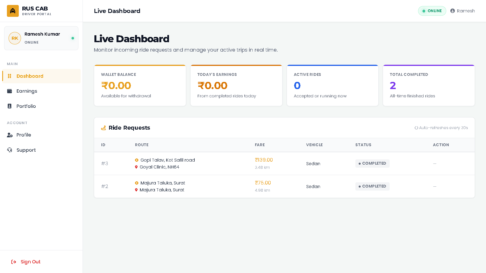
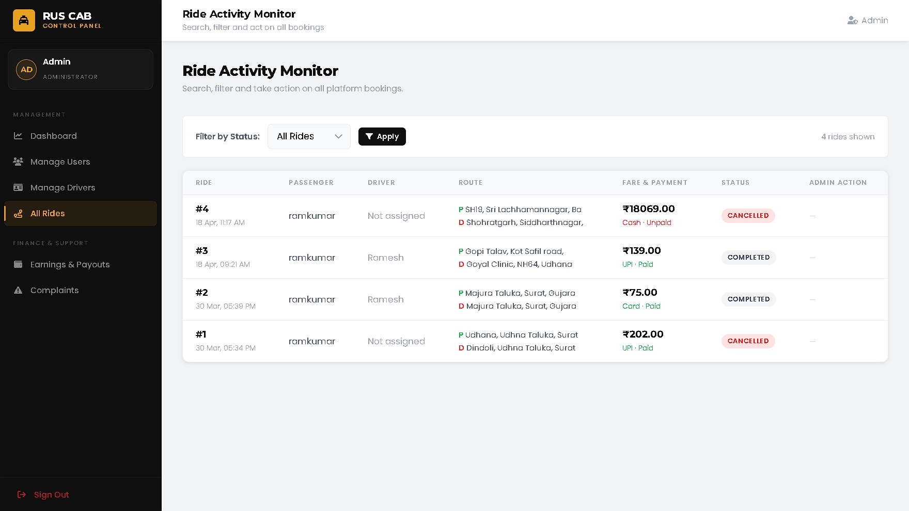

# 🚖 RUS Cab — Ride Booking & Management System


> A role-based cab booking and ride management platform built using PHP, MySQL, and JavaScript.

---

## 📌 Table of Contents

1. [Overview](#overview)
2. [Key Highlights](#key-highlights)
3. [Features](#features)
4. [Tech Stack](#tech-stack)
5. [System Architecture](#system-architecture)
6. [Project Structure](#project-structure)
7. [Getting Started](#getting-started)
8. [Configuration](#configuration)
9. [Deployment](#deployment)
10. [Security](#security)
11. [User Roles](#user-roles)
12. [Known Limitations](#known-limitations)
13. [Future Enhancements](#future-enhancements)
14. [Contributing](#contributing)
15. [Testing](#testing)
16. [Screenshots](#screenshots)
17. [Live Demo](#live-demo)
18. [License](#license)

---

## 🗺️ Overview

**RUS Cab** is a web-based cab booking and ride management system with three dedicated portals — Admin, Driver, and Passenger. It handles the complete ride lifecycle from booking through driver assignment, live status updates, and payment processing.

---

## 🔥 Key Highlights

- Role-based authentication (Admin / Driver / Passenger)
- Full ride lifecycle management (Book → Assign → Start → Complete / Cancel)
- Driver approval and verification workflow
- Payment simulation and transaction workflow
- Driver rating and feedback system
- Secure session-based access control across all panels
- Responsive role-based dashboard system

---

## ✨ Features

### Admin Panel
- Dashboard with system stats — rides, earnings, users, drivers
- Driver management — approve, suspend, view profiles
- Ride history and monitoring
- Earnings reports
- Complaint and support management

### Driver Panel
- Registration with verification workflow
- Portfolio and profile management
- Ride request handling — accept, reject, start, complete, cancel
- Earnings tracker and ride history
- Support ticket submission

### Passenger Portal
- User registration and login with forgot-password recovery
- Ride booking — source, destination, cab type selection
- Ride status tracking
- Payment simulation and transaction workflow
- Ride cancellation
- Driver rating system
- Profile management

---

## 🛠️ Tech Stack

| Layer          | Technology                                     |
|----------------|------------------------------------------------|
| Backend        | PHP 8.x (Procedural + OOP)                     |
| Database       | MySQL via MySQLi                               |
| Frontend       | HTML5, CSS3, JavaScript (ES6)                  |
| Async          | AJAX (XMLHttpRequest for dynamic updates)      |
| Icons          | Bootstrap Icons                                |
| Auth           | PHP Sessions (role-based, server-side)         |
| Server         | Apache (XAMPP / WAMP)                          |
| Styling        | Custom CSS                                     |

---

## 🏗️ System Architecture

```
        ┌──────────────────────┐
        │   Passenger Portal   │
        └──────────┬───────────┘
                   │
                   ▼
        ┌──────────────────────┐
        │    Booking Engine    │
        └──────────┬───────────┘
                   │
                   ▼
        ┌──────────────────────┐
        │  Driver Assignment   │
        └──────────┬───────────┘
                   │
                   ▼
        ┌──────────────────────┐
        │ Ride Lifecycle Mgmt  │
        └──────────┬───────────┘
                   │
                   ▼
        ┌──────────────────────┐
        │   Payment Module     │
        └──────────┬───────────┘
                   │
                   ▼
        ┌──────────────────────┐
        │  Admin Dashboard     │
        └──────────────────────┘
```

| Module                    | Responsibility                                       |
|---------------------------|------------------------------------------------------|
| Passenger Portal          | Ride booking, status tracking, payments, profile     |
| Driver Panel              | Request handling, ride lifecycle, earnings           |
| Admin Panel               | System oversight, approvals, reports, complaints     |
| Booking Engine            | Matching passengers to available drivers             |
| Payment Module            | Simulated payment and transaction workflow           |

---

## 📂 Project Structure

```
RUS_cab/
├── admin/                  # Admin panel
│   ├── index.php           # Admin login
│   ├── dashboard.php
│   ├── drivers.php
│   ├── users.php
│   ├── rides.php
│   ├── earnings.php
│   ├── complaints.php
│   └── admin_logout.php
│
├── driver/                 # Driver panel
│   ├── index.php           # Driver login
│   ├── register.php
│   ├── dashboard.php
│   ├── update_ride.php     # Ride lifecycle management
│   ├── earnings.php
│   ├── profile.php
│   ├── portfolio.php
│   ├── support.php
│   └── driver_logout.php
│
├── public/                 # Client-facing passenger module
│   ├── index.php           # Landing page
│   ├── login.php
│   ├── register.php
│   ├── dashboard.php
│   ├── book.php
│   ├── process_booking.php
│   ├── payment_demo.php
│   ├── cancel_ride.php
│   ├── rate_driver.php
│   └── logout.php
│
├── config/
│   ├── db.php              # ⚠️ Not tracked by Git (credentials)
│   └── db.example.php      # Safe template — copy and configure
│
├── includes/               # Shared layout components
│   ├── header.php
│   └── footer.php
│
├── assets/
│   └── img/
│
├── database.sql            # Full DB schema
├── .gitignore
├── LICENSE
└── README.md
```

---

## 🚀 Getting Started

### Prerequisites

- [XAMPP](https://www.apachefriends.org/) or [WAMP](https://www.wampserver.com/)
- PHP >= 7.4
- MySQL >= 5.7

### Installation

```bash
# 1. Clone the repository
git clone https://github.com/your-username/RUS_cab.git

# 2. Move to your server root
#    Windows: C:/xampp/htdocs/RUS_cab
#    Linux:   /var/www/html/RUS_cab

# 3. Start Apache & MySQL via XAMPP Control Panel

# 4. Set up the database (see below)

# 5. Configure credentials (see Configuration)

# 6. Open in browser
#    http://localhost/RUS_cab/public/
```

### Database Setup

1. Open **phpMyAdmin** → `http://localhost/phpmyadmin`
2. Create a new database: `rus_cab_db`
3. Select the database → **Import** tab → choose `database.sql` → **Go**

---

## ⚙️ Configuration

```bash
# Copy the example config
cp config/db.example.php config/db.php
```

Edit `config/db.php` with your local credentials:

```php
$host    = "localhost";
$db_user = "root";        // Your MySQL username
$db_pass = "";            // Your MySQL password
$db_name = "rus_cab_db";  // Database name
```

> `config/db.php` is excluded from version control via `.gitignore`.

---

## 🚢 Deployment

This project is designed for local Apache environments (XAMPP / WAMP).

For production deployment:

- Use **Apache** or **Nginx** with PHP 8.x support
- Point the document root to the project directory
- Set environment-specific credentials in `config/db.php` (never commit this file)
- Disable PHP error display in `php.ini` (`display_errors = Off`)
- Ensure the MySQL user has least-privilege access to `rus_cab_db`

---

## 🔐 Security

- Session-based authentication across all three panels
- Password hashing before database storage
- Role-based access control — each portal checks session role on every request
- SQL injection prevention via MySQLi prepared statements
- Secure logout — session destruction and redirect
- Sensitive config excluded from version control

---

## 👥 User Roles

| Role      | Login URL                   | Access                          |
|-----------|-----------------------------|---------------------------------|
| Admin     | `/admin/index.php`          | Full system access              |
| Driver    | `/driver/index.php`         | Driver panel, own rides         |
| Passenger | `/public/login.php`         | Booking, payments, profile      |

---

## ⚠️ Known Limitations

- Payment gateway is simulated — no real transaction processing
- No WebSocket or polling-based real-time ride updates
- GPS and live route tracking are not yet integrated
- Optimized for local Apache environments; not production-hardened out of the box
- No production deployment configuration included
- No horizontal scaling or caching layer (Redis, Memcached, etc.)
- Limited concurrency handling — application has not been stress-tested
- No automated test suite

---

## 📈 Future Enhancements

- [ ] Google Maps API integration for live route display
- [ ] Real-time GPS ride tracking via WebSockets
- [ ] Stripe / Razorpay payment gateway
- [ ] Email and SMS notifications
- [ ] Admin analytics dashboard with charts
- [ ] REST API layer for mobile app support
- [ ] Docker containerization for easy deployment

---

## 🤝 Contributing

Contributions, issues, and feature requests are welcome.

1. Fork the repository
2. Create a feature branch (`git checkout -b feature/your-feature`)
3. Commit your changes (`git commit -m 'Add your feature'`)
4. Push to the branch (`git push origin feature/your-feature`)
5. Open a Pull Request

---

## 🧪 Testing

The system has been manually tested across all major workflows including authentication, booking, ride lifecycle, and role-based access control. Edge cases such as invalid login attempts, unauthorized access attempts, duplicate registrations, and ride cancellation flows were also verified.

| Module                     | Test Coverage       |
|----------------------------|---------------------|
| Authentication (all roles) | Manual              |
| Ride booking flow          | Manual              |
| Ride lifecycle             | Manual              |
| Payment simulation         | Manual              |
| Role-based access control  | Manual              |
| Driver rating system       | Manual              |

No automated test suite is currently implemented.

---

## 📸 Screenshots

### Admin Dashboard


### Passenger Booking Page


### Driver Panel


### Ride Tracking


---

## 🌐 Live Demo

Live demo not deployed yet — local environment only.

To run locally:
```
http://localhost/RUS_cab/public/
```

---

## 📄 License

This project is licensed under the **MIT License** — see the [LICENSE](LICENSE) file for details.

---

<p align="center">
  Designed &amp; Developed by <strong>Roshan Gupta</strong>
</p>
